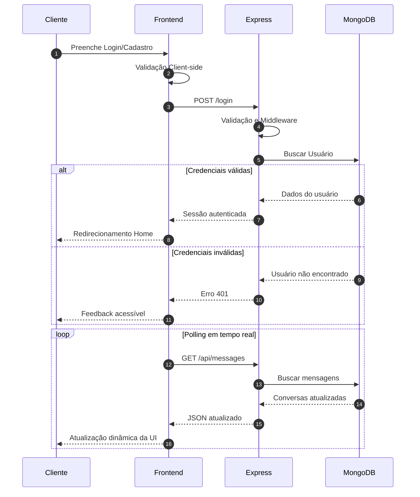

# DOCUMENTAÇÃO TÉCNICA E FUNCIONAL — IMPACTA MAIS

> “Impacta Mais: Plataforma social inteligente voltada para projetos, eventos e conexões de impacto positivo, construída com foco em acessibilidade (WCAG 2.1 AA), UX/UI moderna e arquitetura escalável baseada em Node.js + MongoDB.”

---

# 1. ARQUITETURA DO SISTEMA

## Front-end (EJS + CSS Vanilla + JavaScript)

### Tecnologias

* EJS para renderização server-side dinâmica.
*  CSS Vanilla com Design System próprio.
*  JavaScript Vanilla para interações dinâmicas.
*  Layout responsivo entre 320px e 1920px.

### Design System

*  Navy: `#0f172a`
*  Brand Blue: `#12678D`
*  Emerald: `#10b981`

### Responsabilidade do Front-end

*  Renderizar interfaces acessíveis.
*  Coletar entradas do usuário.
*  Realizar validações client-side.
*  Consumir rotas HTTP do backend.
*  Atualizar UI dinamicamente.

### UX/UI Premium

* Splash Screen animada com SVG.
* Skeleton Loading pulsante.
* Barra de progresso de navegação.
* Scroll suave com IntersectionObserver.
* Glassmorphism em modais.
* Containers responsivos com gestão de densidade visual.
* Menu hambúrguer fullscreen para dispositivos móveis.

---

## Back-end (Node.js + Express 5)

### Responsabilidades

* Gerenciamento de rotas.
* Regras de negócio.
* Autenticação e autorização.
* Segurança da aplicação.
* Persistência de sessões.

### Recursos Implementados

* `express-session`
* `connect-mongo`
* `bcryptjs`
* `helmet`
* Sanitização contra NoSQL Injection.
* Controle de acesso para exportações.
* Recuperação via Recovery Key.

### Segurança

* Hashing de senhas.
* Middleware de proteção.
* Verificação de permissões.
* Escape de Regex.
* Proteção de rotas privadas.

---

## Banco de Dados (MongoDB Nativo)

### Coleções

* `users`
* `posts`
* `events`
* `messages`
* `sessions`

### Estrutura Geral

* Persistência escalável.
* Histórico de mensagens.
* Sistema social integrado.
* Eventos e agenda.
* Sessões persistentes.

---

# 2. FUNCIONALIDADES IMPLEMENTADAS

## 🔐 Autenticação e Perfil

* Cadastro com validação.
* Login seguro.
* Recuperação via Recovery Key.
* Upload de foto Base64.
* Painel do usuário.
* Biografia editável.
* Gestão de eventos organizados.

---

## 🤝 Ecossistema Social

* Sistema de amizades.
* Notificações integradas.
* Chat privado.
* Polling em tempo real.
* Compartilhamento de projetos.
* Busca global inteligente.

---

## 🏆 Sistema de Gamificação

* Medalhas dinâmicas.
* Progressão por volume de projetos.
* Modais interativos.
* Sistema evolutivo:

  * Elo Inicial
  * Nó de Impacto
  * Arquiteto Social

---

## 🚀 Gestão de Projetos

* CRUD completo.
* Upload de imagem.
* Likes e comentários.
* Slugs amigáveis.
* Rich Text.
* Exclusão segura.

---

## 📅 Eventos Inteligentes

* Agendamento completo.
* Eventos futuros e encerrados.
* Filtro temporal automático.
* Inscrição AJAX.
* Área do organizador.
* Exportação CSV.
* Integração:

  * Google Calendar
  * Outlook
  * Arquivos `.ics`


---

# 3. FLUXO DO SISTEMA



---

# 4. DIRETRIZES DE ACESSIBILIDADE (WCAG 2.1 AA)

## Navegação por Teclado

* Skip Link funcional.
* Navegação via Tab/Shift+Tab.
* Focus-visible com alto contraste.
* Fechamento de modais via ESC.

## Semântica HTML5

Uso rigoroso de:

* `<main>`
* `<nav>`
* `<section>`
* `<article>`

## Contraste

* Paleta validada.
* Compatibilidade com daltonismo.
* Contraste WCAG AA.

## Leitores de Tela

* `aria-label`
* `aria-live`
* `aria-controls`
* `role="alert"`
* `role="listbox"`

## Formulários

* Labels explícitas.
* Associação `for/id`.
* Feedback acessível.
* Campos obrigatórios identificados.

## Componentes Customizados

* Medalhas acessíveis.
* Botões focáveis.
* Ícones decorativos ocultados via:
  `aria-hidden="true"`

---

# 5. AUDITORIA TÉCNICA DE ACESSIBILIDADE

## Problemas Corrigidos

* Múltiplos H1 por página.
* Ausência de skip link.
* Focus outline inadequado.
* Melhorias em contraste.
* Navegação mobile refinada.

## Melhorias Implementadas

* `:focus-visible`
* Touch targets ≥ 44px
* Overlay para contraste
* Estrutura semântica revisada

---

# 6. EXEMPLO DE SEGURANÇA BACK-END

```js
app.post("/login", async (req, res) => {
  const { email, password } = req.body;

  const user = await users.findOne({ email });

  if (!user) {
    return res.status(401).json({
      message: "Credenciais inválidas"
    });
  }

  const valid = await bcrypt.compare(
    password,
    user.passwordHash
  );

  if (!valid) {
    return res.status(401).json({
      message: "Credenciais inválidas"
    });
  }

  req.session.userId = user._id;

  return res.status(200).json(user);
});
```

---

# 7. STATUS DE VALIDAÇÃO DO SISTEMA

## ✅ Responsividade

- [x] Aplicação validada entre resoluções:

  - [x] 320px
  - [x] 768px
  - [x] 1920px
- [x] Sem scroll horizontal.
- [x] Componentes adaptativos.
- [x] Touch targets ≥ 44px.

---

## ✅ Funcionalidades Dinâmicas

- [x] Login e Cadastro funcionais.
- [x] Recovery Key operacional.
- [x] CRUD de projetos validado.
- [x] Chat em tempo real funcionando.
- [x] Busca global operacional.
- [x] Agenda inteligente validada.
- [x] Exportação CSV testada.
- [x] Integração Calendar funcional.

---

## ✅ Acessibilidade (WCAG 2.1 AA)

- [x] Navegação por teclado validada.
- [x] Skip Link implementado.
- [x] Focus-visible revisado.
- [x] HTML semântico aplicado.
- [x] Compatibilidade com leitores de tela.
- [x] aria-labels e role="alert".
- [x] Contraste revisado.

---

## ✅ Segurança

- [x] bcryptjs implementado.
- [x] Sessões persistentes.
- [x] Proteção contra NoSQL Injection.
- [x] Middleware de autenticação.
- [x] Rotas privadas protegidas.

---

## ✅ UX/UI e Feedback

- [x] Skeleton Loading funcional.
- [x] Barra de progresso ativa.
- [x] Modais interativos.
- [x] Animações fluidas.
- [x] Interface mobile-first.

---

## ✅ Banco de Dados

- [x] Persistência MongoDB funcional.
- [x] Coleções sincronizadas.
- [x] Histórico persistente.
- [x] Sessões estáveis.

---

## ✅ Conformidade Acadêmica

- [x] 8+ páginas funcionais.
- [x] JavaScript Fullstack.
- [x] Requisitos de acessibilidade atendidos.
- [x] Funcionalidades dinâmicas implementadas.
- [x] Continuidade de desenvolvimento garantida.

---

## ✅ Estado Atual do Projeto

O sistema encontra-se:

- [x] funcional;
- [x] responsivo;
- [x] acessível;
- [x] escalável;
- [x] estável;
- [x] apto para expansão futura;
- [x] pronto para demonstração acadêmica.

---

# 8. CHECKLIST DE VALIDAÇÃO

## ✓ Responsividade

- [x] Mobile
- [x] Tablet
- [x] Desktop

## ✓ Segurança

- [x] Sessões protegidas
- [x] Hash de senha
- [x] Sanitização
- [x] Middleware

## ✓ Acessibilidade

- [x] Navegação por teclado
- [x] Hierarquia semântica
- [x] Contraste validado
- [x] Screen readers

## ✓ Funcionalidades

- [x] CRUD
- [x] Eventos
- [x] Chat
- [x] Compartilhamento
- [x] Exportação CSV
- [x] Calendário

---

# 9. ESTRUTURA FUNCIONAL DA APLICAÇÃO

A aplicação possui mais de 8 páginas funcionais:

1. Landing Page
2. Login
3. Cadastro
4. Home Feed
5. Perfil
6. Projetos
7. Eventos
8. Agenda
9. Chat
10. Painel do Organizador
11. Configurações

---

# 10. LINKS IMPORTANTES

## Protótipo

https://www.figma.com/site/gwU3TiwXzl2TfwsXofZA8W/impactamais

---

# 11. CONCLUSÃO

O projeto Impacta Mais apresenta uma arquitetura moderna, escalável e alinhada às melhores práticas de desenvolvimento web contemporâneo.

A aplicação integra:

- acessibilidade digital;
- UX/UI avançada;
- segurança;
- comunicação em tempo real;
- gestão social inteligente.

A solução demonstra maturidade técnica, conformidade com WCAG 2.1 AA e capacidade de expansão para aplicações reais em instituições sociais, educacionais e corporativas.