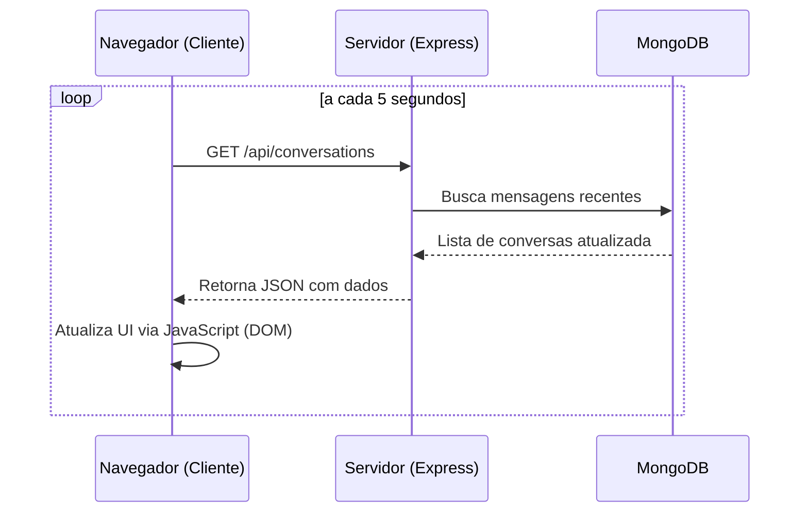

# DOCUMENTAÇÃO TÉCNICA E FUNCIONAL - IMPACTA MAIS

> "Impacta Mais: Uma plataforma de conexão social para projetos e eventos de impacto positivo, focada em acessibilidade (WCAG 2.1 AA) e performance (Node.js + MongoDB Nativo)."

---

## 1. ARQUITETURA DO SISTEMA

### Front-end (EJS + CSS Vanilla)
- **Engine**: EJS para renderização server-side dinâmica.
- **Estilização**: CSS Vanilla com Design System baseado em variáveis (Cores: Navy #0f172a, Brand Blue #12678D, Emerald #10b981).
- **Responsividade**: Layout fluído de **320px a 1920px** com componentes adaptativos (ex: Navbar com Menu Hambúrguer).
- **UX Especial**: 
    - Splash Screen animado (Handshake SVG) exibido apenas no primeiro acesso da sessão.
    - **Skeletons de Loading**: Feedback visual pulsante na busca global para reduzir o tempo de espera percebido.
    - **Barra de Progresso (Top Loading)**: Feedback imediato de navegação no topo da tela ao trocar de página.
    - **Transições Fluidas**: Animações de entrada (`Fade In Up`) e scroll suave com `IntersectionObserver`.
    - **Hero Modernizado**: Layout centralizado com divisor de ondas (SVG) para transições orgânicas entre seções.
    - **Gestão de Densidade**: Uso de containers com altura fixa e scrollbars customizados para listas longas (Projetos, Agenda, Eventos), garantindo simetria visual no perfil do usuário.
    - **Interação Premium**: Modais de conquistas e detalhamento com animações de entrada e desfoque de fundo (Glassmorphism).

### Back-end (Node.js + Express 5)
- **Sessões**: `express-session` com persistência em MongoDB via `connect-mongo`.
- **Segurança**: 
    - `bcryptjs` para hashing de senhas.
    - `helmet` para proteção de cabeçalhos.
    - Escapamento de Regex para evitar NoSQL Injection na busca.
    - Validação de tokens para recuperação de senha.
    - **Controle de Acesso em Exportações**: Verificação de autorização (Middleware + Lógica de Rota) para garantir que apenas organizadores exportem dados de participantes.

### Banco de Dados (MongoDB Nativo)
- **Coleções**:
    - `users`: Perfis, amizades, notificações, histórico de eventos.
    - `posts`: Projetos sociais, slugs únicos, curtidas, comentários e descrições detalhadas.
    - `events`: Agenda de ações sociais e lista de participantes.
    - `messages`: Histórico de mensagens privadas entre amigos.
    - `sessions`: Persistência de estado do usuário.

---

## 2. FUNCIONALIDADES IMPLEMENTADAS

### 🔐 Autenticação e Perfil
- **Fluxo de Cadastro**: Validação de e-mail único e confirmação de senha com vínculo à Política de Privacidade.
- **Login Seguro**: Gestão de sessão persistente.
- **Recuperação de Senha**: Sistema de "Esqueci minha senha" com envio de e-mail (Nodemailer) e tokens de expiração (1h).
- **Edição de Perfil**: Alteração de Biografia e Foto de Perfil (Suporte a Base64).
- **Painel de Controle do Usuário**: Visualização de projetos criados, amigos e agora uma seção dedicada para **"Meus Eventos"** organizados.

### 🤝 Ecossistema Social e Compartilhamento
- **Sistema de Amizade**: Envio, aceitação e recusa de solicitações entre usuários com verificação de status em tempo real.
- **Notificações Integradas**: Alertas visuais para novas solicitações, aceites de amizade e novas mensagens.
- **Mensagens Dinâmicas**: 
    - Chat direto entre amigos com persistência de histórico.
    - **Sincronização em Tempo Real (Polling)**: A lista de conversas e as mensagens são atualizadas automaticamente a cada 5 segundos sem necessidade de recarregar a página.
- **Busca Global**: Barra de pesquisa inteligente que localiza **Projetos** e **Pessoas** simultaneamente.
- **Compartilhamento Integrado**: 
    - Modal de compartilhamento com cópia rápida de URL do projeto.
    - **Encaminhamento Direto**: Envio de links de projetos para amigos via sistema de mensagens interno com um clique.
- **Sistema de Gamificação (Medalhas)**:
    *   Cálculo dinâmico de conquistas baseado no volume de projetos criados.
    *   Interface de medalhas 2D Flat Premium com títulos evolutivos: **Elo Inicial** (5), **Nó de Impacto** (10) e **Arquiteto Social** (20).
    *   Interação de clique para detalhamento de ações de conquista em modais dedicados.

### 🚀 Gestão de Conteúdo e Eventos
- **Projetos (Posts)**:
    - Criação com upload de imagem, descrição curta e **descrição detalhada (Rich Text/Long Description)**.
    - Geração automática de Slugs amigáveis para URLs limpas.
    - Sistema de **Likes** e **Comentários**.
    - **Exibição Cronológica Precisa**: Datas de postagem formatadas (ex: 13 de maio de 2026) no feed, garantindo clareza sobre a longevidade das iniciativas.
    - **Exclusão Segura**: Interface de "Zona de Perigo" nos detalhes do projeto, permitindo que apenas o autor remova a publicação com confirmação do navegador.
- **Eventos e Agenda**:
    - Agendamento com data, hora e local.
    - **Ciclo de Vida de Eventos**: Separação automática entre "Próximos" e "Encerrados" com estilização visual diferenciada (grayscale para eventos passados).
    - **Filtro de Relevância Temporária**: O feed e a sidebar agora filtram eventos em tempo real, ocultando automaticamente aqueles que já ultrapassaram a data e o horário atual.
    - **Inscrição Rápida (AJAX)**: Botão "Avise-me" na barra lateral de projetos que inscreve o usuário instantaneamente no evento com feedback visual imediato.
    - **Transparência e Consentimento**: Nota informativa automática sobre compartilhamento de e-mail com o organizador no momento da inscrição.
    - **Área do Organizador**: Painel exclusivo visível apenas para o autor do evento, permitindo a gestão de inscritos.
    - **Exportação de Dados**: Funcionalidade de download da lista de participantes em formato **CSV** (otimizado para Excel com BOM UTF-8), acessível apenas por organizadores autorizados.
    - **Exclusão de Evento**: Botão de remoção definitiva integrado à Área do Organizador, com verificação de autoria no backend para segurança dos dados.
    - **Agendamento Inteligente (Multi-Platform)**:
        - Integração nativa com **Google Calendar** e **Outlook Web** via deep links dinâmicos.
        - Geração de arquivos **.ics** via rota dedicada para suporte universal (Apple Calendar, Windows Calendar, etc).
        - Lógica de cálculo de horários com duração padrão de 2 horas e formatação compatível com padrões internacionais (RFC 5545).
    - Gestão de participação vinculada ao perfil com lógica de ocultação de botões de inscrição para o próprio criador.

### ✨ Polimento UI/UX e Conformidade
- **Página de Política de Privacidade**: Nova seção dedicada para transparência de dados, integrada diretamente no fluxo de cadastro.
- **Feedback Visual Instantâneo**: Barra de progresso no topo da tela acionada em toda transição de página.
- **Navegação Mobile Otimizada**: Menu hambúrguer em tela cheia com acesso rápido a mensagens e perfil.

---

## 3. DIRETRIZES DE ACESSIBILIDADE (WCAG 2.1 AA)

1.  **Navegação por Teclado**: 
    - *Skip Link* funcional no topo para saltar navegações repetitivas.
    - **Percurso Completo**: Navegação total via Tab/Shift+Tab em todos os elementos interativos do site, garantindo independência do mouse.
    - Estados de `:focus-visible` com anel de destaque (Emerald 500) de alto contraste.
    - Trava de foco em modais e fechamento via tecla `Esc`.
    - **Interatividade Acessível**: Medalhas e componentes customizados implementados como elementos focáveis (`button`) com `aria-labels` descritivos para leitores de tela.
2.  **Hierarquia de Títulos (H1-H6)**: Estrutura semântica corrigida em todas as páginas para garantir um único `H1` por documento e progressão lógica.
3.  **Semântica HTML5**: Uso rigoroso de `<main>`, `<nav>`, `<article>` e `<section>`.
4.  **Contraste e Cores**: Paleta validada e suporte a filtros de daltonismo/dislexia via menu de acessibilidade.
5.  **Formulários**: Labels explícitos associados via `id` e mensagens de erro acessíveis.

---

## 4. ESPECIFICAÇÕES TÉCNICAS (EXEMPLOS)

### Fluxo de Mensagens Dinâmicas (Polling)

---

## 5. STATUS DE VALIDAÇÃO (CHECKLIST)

- [x] **Responsividade**: Testado em Mobile (320px), Tablet (768px) e Desktop (1920px).
- [x] **Sincronização**: Mensagens e conversas atualizando sem refresh.
- [x] **Acessibilidade**: Validação manual de teclado e hierarquia de títulos concluída.
- [x] **Segurança**: Proteção de rotas, hashing de senhas e sanitização de entradas.
- [x] **Conformidade Legal**: Política de privacidade implementada e vinculada com notas de consentimento em inscrições.
- [x] **Gerenciamento de Conteúdo**: Sistema de exclusão segura para autores e exibição de datas precisas implementados.
- [x] **Manutenção e Expansão**: logs básicos e estrutura escalável.

---

## 6. MANUTENÇÃO E EXPANSÃO
- **Logs**: Monitoramento básico via console em rotas críticas.
- **Escalabilidade**: Sistema de polling preparado para transição suave para WebSockets se necessário.
- **Performance**: Requisições de API otimizadas e imagens processadas em Base64.
